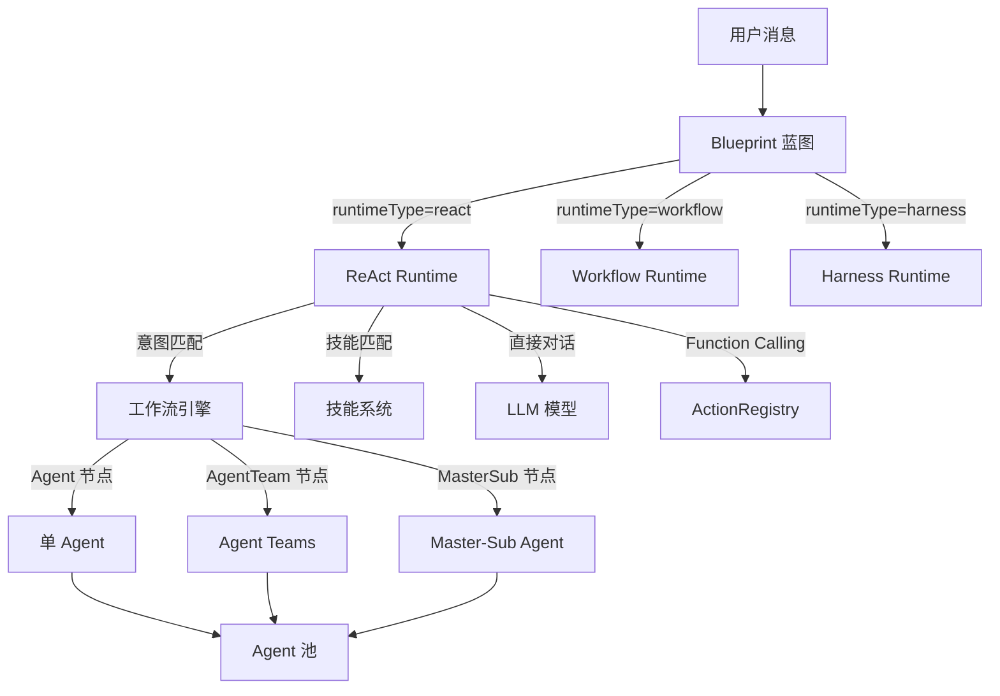
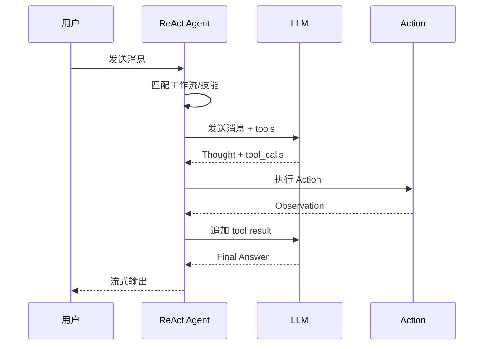
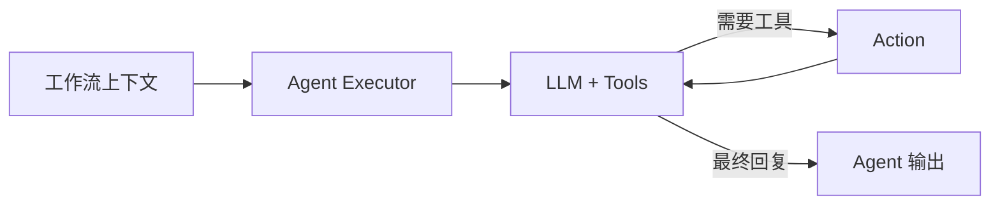
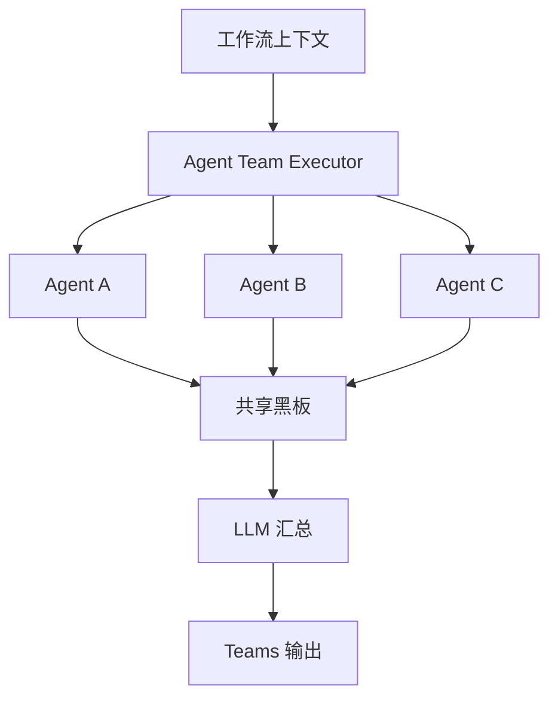
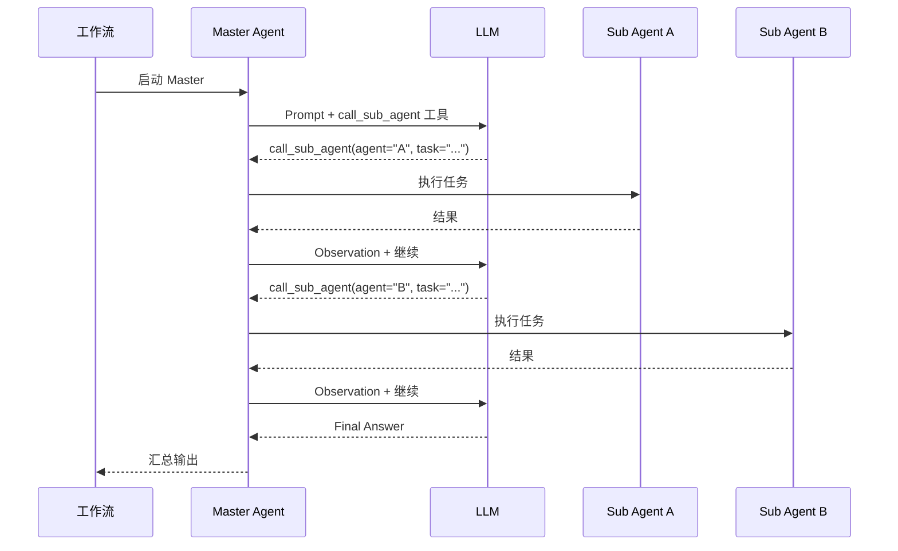

# 🤖 Agent 系统文档

> 本文档详细描述 WanJu 智能客服系统的 Agent 架构、运行机制和开发指南。

---

## 1. 概述

WanJu 系统中有三层 Agent 体系：

| 体系 | 角色 | 入口 |
|------|------|------|
| **Blueprint 蓝图** | 可部署的智能体单元，定义运行时类型和配置 | `BlueprintService` + `RuntimeFactory` |
| **ReAct Agent** | 全局对话 Agent，所有用户消息的入口 | `ReactRuntime.execute()` |
| **Agent 池** | 可配置的 Agent 集合，在工作流节点中被调用 | `AgentService` + 工作流 Executor |



---

## 2. ReAct Agent — 全局对话核心

### 2.1 架构

ReAct（Reasoning + Acting）循环是系统的对话核心，位于 [`react-agent.service.ts`](file:///Users/wangchanglong/Desktop/code/wanju/server/src/domain/ai/service/react-agent.service.ts)。

```
用户消息
  ↓
① 工作流匹配 → 命中 → 执行工作流
  ↓ 未命中
② 技能匹配 → 激活技能 Prompt
  ↓
③ ReAct 循环（最多 10 轮）
  ├── Thought  — LLM 思考推理
  ├── Action   — Function Calling 调用工具
  └── Observation — 获取工具结果
  ↓
④ Final Answer — 最终回复
```

### 2.2 ReAct 循环流程



### 2.3 配置

```typescript
// server/src/config/config.default.ts
ai: {
  apiKey: process.env.AI_API_KEY,
  apiBase: process.env.AI_API_BASE,
  model: process.env.AI_MODEL,          // 如 qwen3.7-plus
  systemPrompt: '你是...',              // 全局系统提示词
}
```

### 2.4 System Prompt 组成

ReAct Agent 的 System Prompt 由以下部分动态拼接：

| 部分 | 来源 | 说明 |
|------|------|------|
| 基础角色 | `config.ai.systemPrompt` | 全局角色定义 |
| ReAct 规范 | 硬编码 | Thought/Action/Observation 格式要求 |
| 记忆系统说明 | 硬编码 | 长期记忆使用指引 |
| 用户信息收集 | 硬编码 | 自然收集用户信息的指引 |
| 已收集用户信息 | `CustomerService` | 当前对话已收集的字段 |
| 已激活技能 | `SkillService.matchByText()` | 命中的技能 Prompt |

---

## 3. ActionRegistry — 集中管理工具箱

### 3.1 ActionRegistry

Action 的注册与查询由 [`ActionRegistry`](file:///Users/wangchanglong/Desktop/code/wanju/server/src/domain/ai/action/action-registry.ts) 集中管理，消除了各 Runtime 中重复注入 Action 的代码。

```typescript
// ✅ 推荐：使用 ActionRegistry
@Inject()
actionRegistry: ActionRegistry;

const allActions = this.actionRegistry.getAll();           // 获取全部
const enabled = this.actionRegistry.getEnabled(['search_knowledge']); // 按名称子集
```

### 3.2 Action 接口

所有 Action 实现 [`Action`](file:///Users/wangchanglong/Desktop/code/wanju/server/src/domain/ai/action/action.interface.ts) 接口：

```typescript
interface Action {
  definition(): ActionDefinition;  // 工具定义（name + description + parameters）
  execute(args: any, context: ActionContext): Promise<ActionResult>;
}

interface ActionResult {
  output: string;      // 返回给 LLM 的文本
  ssePayload?: any;    // 发送给前端的 SSE 数据
}
```

### 3.3 内置 Action

| Action | 文件 | 功能 |
|--------|------|------|
| `create_ticket` | [`create-ticket.action.ts`](file:///Users/wangchanglong/Desktop/code/wanju/server/src/domain/ai/action/create-ticket.action.ts) | 创建客服工单 |
| `search_knowledge` | [`search-knowledge.action.ts`](file:///Users/wangchanglong/Desktop/code/wanju/server/src/domain/ai/action/search-knowledge.action.ts) | 搜索知识库（RAG） |
| `save_customer_info` | [`save-customer-info.action.ts`](file:///Users/wangchanglong/Desktop/code/wanju/server/src/domain/ai/action/save-customer-info.action.ts) | 保存用户信息到客户档案 |

### 3.4 添加新 Action

1. 创建 `server/src/domain/ai/action/<name>.action.ts`
2. 实现 `Action` 接口
3. 在 `configuration.ts` 中注册 IoC 标识
4. 在 `ActionRegistry` 中添加注入和注册

```typescript
// 示例：查询物流 Action
@Provide('action:query_logistics')
export class QueryLogisticsAction implements Action {
  definition(): ActionDefinition {
    return {
      name: 'query_logistics',
      description: '根据订单号查询物流信息',
      parameters: {
        type: 'object',
        properties: {
          orderId: { type: 'string', description: '订单号' },
        },
        required: ['orderId'],
      },
    };
  }

  async execute(args: any, context: ActionContext): Promise<ActionResult> {
    // 实现逻辑
    return { output: '物流信息...', ssePayload: { ... } };
  }
}
```

---

## 4. Agent 池 — 可配置 Agent 集合

### 4.1 数据模型

```typescript
interface Agent {
  id: string;
  name: string;          // Agent 名称
  description: string;   // Agent 描述
  prompt: string;        // System Prompt
  actions: string[];     // 可用 Action 名称列表（如 ['search_knowledge', 'create_ticket']）
  icon: string;          // 图标 emoji
  enabled: boolean;      // 是否启用
}
```

### 4.2 管理接口

| 方法 | 端点 | 说明 |
|------|------|------|
| `GET` | `/api/agents` | 获取所有 Agent |
| `GET` | `/api/agents/:id` | 获取单个 Agent |
| `POST` | `/api/agents` | 创建 Agent |
| `PUT` | `/api/agents/:id` | 更新 Agent |
| `DELETE` | `/api/agents/:id` | 删除 Agent |
| `POST` | `/api/agents/generate-prompt` | AI 自动生成 System Prompt |

### 4.3 AI Prompt 生成

`AgentService.generatePrompt(name, description)` 可以根据 Agent 名称和描述自动生成专业的 System Prompt，减轻用户编写负担。

---

## 5. 工作流中的 Agent 节点

### 5.1 三种 Agent 节点类型

#### 🧑‍💼 单 Agent 节点

```
AgentExecutor → 从 Agent 池选择 1 个 Agent → 执行任务
```

- **配置**：选择一个 Agent（`agentId`）
- **执行**：用 Agent 的 Prompt 作为 System Prompt，将工作流上下文（提取参数 + 上游节点结果）注入 Prompt
- **支持 Function Calling**：如果 Agent 配置了 `actions`，会自动构建 tools 列表，支持最多 5 轮 ReAct 循环



#### 👥 Agent Teams 节点

```
AgentTeamExecutor → 选择 N 个 Agent → 并行执行 → 共享黑板汇总
```

- **配置**：多选 Agent（`agentIds`）
- **执行**：所有 Agent 使用 `Promise.all` 并行执行
- **黑板机制**：每个 Agent 的结果写入共享黑板（`Map<agentName, output>`），最终由 LLM 汇总



#### 👑 Master-Sub Agent 节点

```
MasterSubAgentExecutor → Master Agent 编排 → 通过 call_sub_agent 工具调用 Sub Agent
```

- **配置**：1 个 Master Agent（`masterAgentId`）+ N 个 Sub Agent（`subAgentIds`）
- **执行**：Master Agent 获得一个特殊工具 `call_sub_agent`，可以自主决定何时调用哪个 Sub Agent
- **最多 8 轮**：Master 每轮可调用工具，Sub Agent 的输出作为 Observation 返回给 Master



### 5.2 Agent 节点中的上下文注入

所有 Agent 节点在执行时，会将以下信息注入到 Agent 的 System Prompt 中：

```
{agent.prompt}

提取参数: {"订单号": "123456", "退款原因": "质量问题"}
上游节点结果:
节点 extract_xxx: {"订单号": "123456"}
节点 knowledge_xxx: {"results": [...]}
```

---

## 6. LLM 抽象层

### 6.1 端口接口

[`ILLMClient`](file:///Users/wangchanglong/Desktop/code/wanju/server/src/domain/ai/port/llm.port.ts) 定义了四个方法：

```typescript
interface ILLMClient {
  chat(messages, options?): Promise<LLMChatResult>;      // 非流式（支持 tool calling）
  chatStream(messages): AsyncGenerator<string>;           // 流式对话（纯文本）
  complete(prompt, options?): Promise<string>;            // 简单文本补全
  completeStream(prompt, options?): AsyncGenerator<string>; // 流式文本补全（逐 token）
}
```

> `completeStream` 用于工作流 LLM 节点的流式输出，前端通过 `content_chunk` 事件逐 token 追加显示。

### 6.2 实现

实现位于 `server/src/infrastructure/llm/`，支持 OpenAI 兼容接口（通义千问、Groq、Ollama 等）。

---

## 7. SSE 事件协议

Agent 执行过程中通过 SSE 实时推送事件到前端：

| 事件类型 | 触发时机 | 关键字段 |
|----------|----------|----------|
| `skill_match` | 技能匹配成功 | `skills: [{id, name, icon}]` |
| `thinking_end` | 一轮思考完成 | `round, content, timeMs` |
| `tool_start` | 开始调用工具 | `tool, args` |
| `tool_result` | 工具返回结果 | `tool, result, timeMs` |
| `content` | 完整内容输出（独立气泡） | `content` |
| `content_chunk` | 流式 token 输出（追加到当前气泡） | `chunk` |
| `workflow_match` | 工作流匹配成功 | `workflowId, workflowName, workflowIcon` |
| `workflow_start` | 工作流开始执行 | `workflowId, workflowName, stepCount` |
| `workflow_step` | 工作流步骤完成 | `stepIndex, nodeId, stepType, result, timeMs` |
| `workflow_llm` | 工作流 LLM 调用 | `stage, nodeId, purpose` |
| `workflow_end` | 工作流执行结束 | `totalSteps, totalTimeMs` |
| `error` | 错误 | `content` |

---

## 8. 三层记忆系统

Agent 的记忆由 [`MemoryManagerService`](file:///Users/wangchanglong/Desktop/code/wanju/server/src/domain/chat/service/memory-manager.service.ts) 统一管理：

| 层级 | 存储 | 内容 | 生命周期 |
|------|------|------|----------|
| **短期记忆** | Redis | 最近 20 条消息 | 24 小时 TTL |
| **摘要记忆** | Redis | 历史对话压缩摘要 | 24 小时 TTL |
| **长期记忆** | mem0（向量化） | 用户画像 + 业务信息 | 永久 |
| **持久化** | SQLite | 全量消息记录 | 永久 |

### 记忆注入流程

```
getAIContext(conversationId, userId)
  ├── 读取用户基础信息（mem0 profile 类型）
  ├── 搜索相关长期记忆（mem0 语义检索）
  ├── 读取对话摘要（Redis）
  └── 读取最近消息（Redis 短期记忆）
  → 拼接为 AIMessage[] 发送给 LLM
```

---

## 9. Blueprint 蓝图系统

### 9.1 概述

AgentBlueprint（智能体蓝图）是可部署的智能体单元，定义了智能体的运行时类型和完整配置。例如系统默认的「智能对话」就是一个 `runtimeType='react'` 的蓝图实例。

### 9.2 运行时类型

| RuntimeType | 运行时 | 说明 |
|-------------|--------|------|
| `react` | [`ReactRuntime`](file:///Users/wangchanglong/Desktop/code/wanju/server/src/domain/ai/runtime/react.runtime.ts) | 完整 ReAct Agent — Thought/Action/Observation 循环 |
| `workflow` | [`WorkflowRuntime`](file:///Users/wangchanglong/Desktop/code/wanju/server/src/domain/ai/runtime/workflow.runtime.ts) | 直接执行绑定的工作流 |
| `harness` | [`HarnessRuntime`](file:///Users/wangchanglong/Desktop/code/wanju/server/src/domain/ai/runtime/harness.runtime.ts) | 可编排处理链（LLM/Action/Workflow/Agent 步骤 + 条件/循环） |

### 9.3 RuntimeFactory

[`RuntimeFactory`](file:///Users/wangchanglong/Desktop/code/wanju/server/src/domain/ai/runtime/runtime.factory.ts) 根据 `runtimeType` 创建对应的运行时引擎：

```typescript
const runtime = this.runtimeFactory.create(blueprint.runtimeType);
yield* runtime.execute(messages, { blueprintId, config: blueprint.config });
```

### 9.4 ReAct 蓝图配置

```typescript
interface ReactRuntimeConfig {
  systemPrompt: string;
  agentId?: string;                // 绑定 Agent 池中的 Agent
  actions: string[];               // 可用 Action 名称列表
  skillIds: string[];              // 可用技能 ID 列表
  workflowIds: string[];           // 可用工作流 ID 列表
  maxRounds: number;               // ReAct 最大循环轮数
  temperature: number;
  enableMemory: boolean;           // 是否启用记忆系统
  enableCustomerCollection: boolean; // 是否启用客户信息收集
  inheritAgentCapabilities: boolean; // 继承绑定 Agent 的 actions/skills/workflows
}
```

### 9.5 对话隔离

对话按 `blueprintId` 隔离，不同蓝图各自独立的对话列表。前端通过 URL 参数 `?blueprint=<id>` 传递蓝图标识。

---

## 10. 开发指南

### 添加新 Action（工具）

参见 [RULES.md](file:///Users/wangchanglong/Desktop/code/wanju/RULES.md) 和上文第 3.4 节。

### 添加新 Agent 节点类型

1. 创建 `server/src/domain/workflow/executor/<name>.executor.ts`
2. 实现 `INodeExecutor` 接口
3. 在 `executor/index.ts` 的 `createDefaultRegistry()` 中注册
4. 前端添加节点元数据和属性面板

### 添加新运行时类型

1. 在 `blueprint/model/blueprint.model.ts` 中添加 `RuntimeType` 和对应配置接口
2. 创建 `ai/runtime/<name>.runtime.ts`，实现 `IAgentRuntime` 接口
3. 在 `RuntimeFactory.create()` 中注册
4. 前端 `BlueprintEditor` 中添加配置表单

### 切换 LLM 模型

修改 `server/.env` 中的 `AI_API_KEY` / `AI_API_BASE` / `AI_MODEL`，支持任何 OpenAI 兼容接口。
